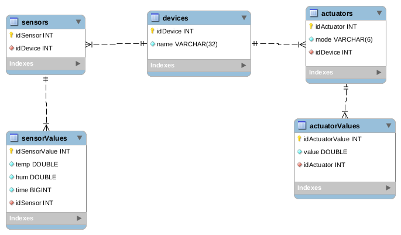
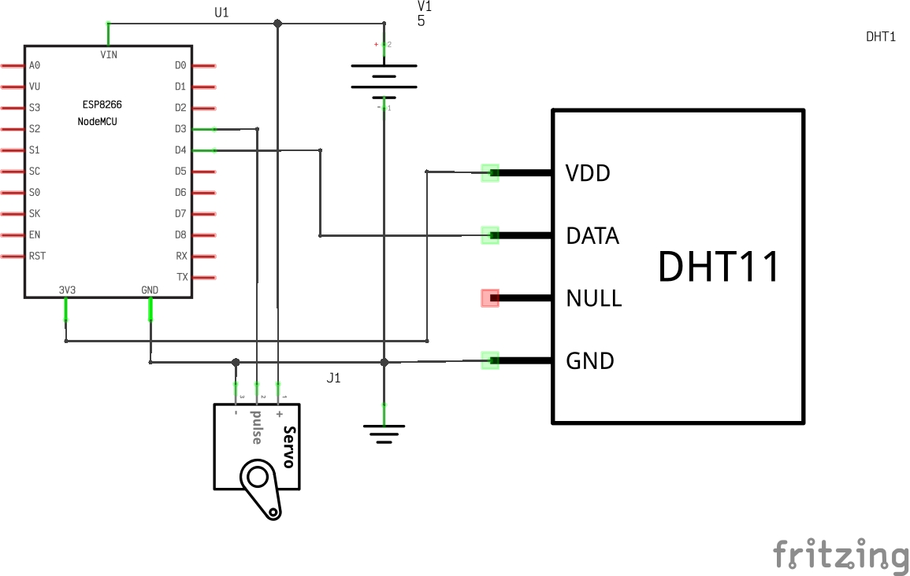
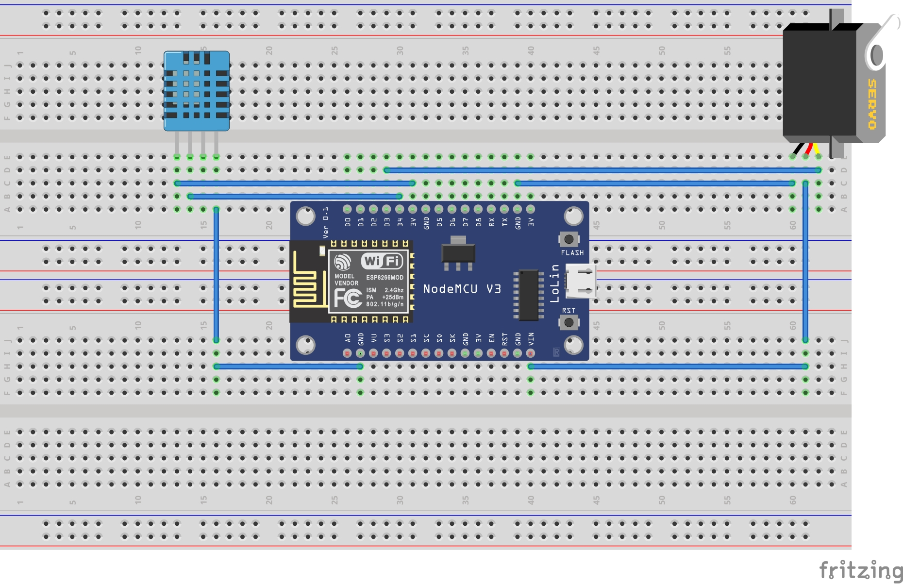

---

Autores:
  - José Julián Manzano Montenegro
  - Gadi Macías Sánchez
  
---

# AirSystem

Este proyecto denominado AirSystem trata sobre la monitorización de salas donde se encuentran diferentes dispositivos con sensores y actuadores encargados de controlar la humedad y la temperatura de las salas. En el caso de que uno o ambas salas sobrepasen una temperatura y/o humedad haciendo uso de los actuadores abriremos las ventanas para ayudar a la ventilación de la sala y así intentar mejorar la calidad de la estancia en la sala. 

## Índice 

* [Base de Datos.](#id1)
* [API REST.](#id2)
* [MQTT.](#id3)
* [ESP32.](#id4)
* [Esquema Eléctrico](#id5)
* [Montaje en ProtoBoard](#id6)


### Base de Datos.<a name="id1"></a>
***
La base de datos diseñada para nuestro proyecto consta de 5 tablas: sensors, actuators, devices, actuatorsValues, sensorValues. Para cada tabla hemos usado atributos básicos ya que queríamos obtener una base de datos simple que nos permitiese almacenar los valores captados por los sensores y actuadores. En esta primera tabla mencionada almacenaremos el idSensor que distinguirá cada sensor y el idDevice, que hará la distinción del dispositivo(placa) donde se encuentra. Relacionada con esta tabla tendremos la tabla sensorValues donde se almacenarán los valores de temperatura (temp), humedad (hum), time(fecha) e idSensor para diferenciar como hemos descrito antes el dispositivo. De la tabla actuators podemos decir que es parecida pero con los atributos asociados a los actuadores, idActuators(para distinguir entre los diferentes actuadores), mode(indicación del modo del actuador), e idDevice para saber a qué dispositivo pertenece cada actuador. En la tabla devices tenemos el idDevice que identificará cada placa que empiece a almacenar valores y el atributo name de tipo VARCHAR donde se almacenará el nombre del dispositivo (placa). 

NOTA: Aprovechando que soy propietario(Julián) de un dominio+hosting, hemos decidido alojar la base de datos en el hosting, añadiendo así un plus a nuestro proyecto, evitando problemas con el firewall o con la ip/port y logrando que nuestro proyecto sea más distribuido.



### API REST<a name="id2"></a>
***
Para el diseño de la API REST hemos creado métodos básicos que nos conecten con la base de datos, ya que tras analizar la idea del proyecto no hemos visto necesaria la creación de ningún método especial. 

Nuestra APIREST consta de:


* Métodos GET: 
   * Hemos creado un método GET para cada tabla. 
   Para cada una de las tablas (actuators, actuatorsValues, sensors, sensorValues y devices) hemos implementado un método GET básico que devuelve toda la información  
   de cada una de las tablas. 
* Métodos GET(ByID): Estos métodos los hemos implementado en cada una de las tablas para obtener así información de cada sensor, actuador o cada placa.
* Métodos POST: Para insertar nuevos sensores, actuadores o dispositivos (con sus correspondientes sensores o actuadores) hemos usado métodos POST. Uno para cada una de las
tablas. Por último, en cuanto al cuerpo de las peticiones para los métodos POST hemos usado un JSON para las columnas en la base de datos, es necesario insertar también el id de cada sensor/actuador junto al de dispositivo ya que cada dispositivo tiene sus propios actuadores y sensores. Al principio lo insertamos automáticamente pero nos dimos cuenta de que así era una mejora del proyecto.

Para estas peticiones hemos usado URLs intuitivas y cortas. La nomenclatura es "/api/(nombre_de_la_tabla)/(id_en_caso_de_get_By_ID).
- GET url/api/sensors: muestra todos los sensores (/id para mostrar solo el de dicha id).
- GET url/api/actuators: muestra todos los actuadores (/id para mostrar solo el de dicha id).
- GET url/api/devices: muestra todos los devices (/id para mostrar solo el de dicha id).
- GET url/api/sensorValue: muestra todos los sensorValues datos de las lecturas de los sensores (/id para mostrar solo el de dicha id).
- GET url/api/actuatorValue: muestra todos los actuatorValues datos de valores de los actuadores (/id para mostrar solo el de dicha id).
- POST url/api/sensors + body(json): para añadir sensor (Es necesario indicar el idSensor en el body).
- POST url/api/actuators + body(json): añade actuador (Es necesario indicar el idActuator en el body).
- POST url/api/devices: añade device (Es necesario indicar el idSevice en el body).
- POST url/api/sensorValue + body(json): añade lectura del sensor.
- POST url/api/actuatorValue + body(json): añade lectura del valor del actuador.

La url será en la que se esté ejecutando el .JAR en nuestro caso apirest.manzamontedev.site

Durante la implementación de estas peticiones hemos usado Postman, se trata de un cliente HTTP que nos da la posibilidad de testear 'HTTP requests' a través de una interfaz gráfica de usuario, por medio de la cual obtendremos diferentes tipos de respuesta.

Por último, en cuanto al cuerpo de las peticiones para los métodos POST utilizamos un JSON por columnas en la base de datos, es necesario la aclaración de que para insertar valores a través de estas peticiones el cuerpo debe de contener todos los atributos (menos el Id de cada tabla, ya que se inserta automáticamente, excepto en la tablas: Devices, Actuators, Sensors ya que estos id los inserta la placa al iniciarse, al usar postman es necesario indicarlos) o de lo contrario la petición no será válida.

En este caso la APIRest hemos empaquetado el código en un ejecutable .JAR que se ejecuta en un contenedor (PODMAN) alojado en la RaspBerry Pi 4, para acceder uso otro túnel usando CloudFlare(ya que ngrok tiene limitación de un solo túnel para cuentas gratuitas). Aquí el uso de contenedores es una forma de mostrar como el proyecto funciona de forma distribuida con cada parte MQTT, Cliente, Base de Datos y APIRest ejecutándose en entornos separados.

Para correr el contenedor de la Api hemos tenido que construir una image usando como base un contenedor JDK:

Mediante la creacción del archivo DOCKERFILE:

```docker
FROM arm64v8/openjdk:16-jdk-slim-bullseye
RUN apt-get install -y tzdata
ENV TZ Europe/Madrid
VOLUME ["/home"]
COPY ./app/AirSystem-0.0.1-SNAPSHOT-fat.jar /home
ENTRYPOINT ["java", "-jar", "/home/AirSystem-0.0.1-SNAPSHOT-fat.jar"]
```
Con el siguiente comando creamos la imagen:

```bash
sudo podman build -t apirest -f Dockerfile
```
con este comando ejecutamos la imagen que hemos creado:

```bash
sudo podman run -d --name=apirest -p 8080:8080 apirest 
```
podemos ver la ejecucion de la imagen mediante el siguiente comando (De igual forma que vemos la consola en eclipse):

```bash
sudo podman logs -f apirest
```
Configurando en la web de cloudflare el tunél para que permita el trafico del localhost:8080 por el subdominio apirest.manzamontedev.site
podemos acceder a la api desde ese subdominio

***Nota:*** Hemos añadido CORS en VerticleServer.java para poder permitir los POST.

### MQTT<a name="id3"></a>

El uso de MQTT para nuestro proyecto es necesario para tener un sistema de sensores y actuadores eficientes permitiendo la comunicación entre Verticles y la placa. 
De manera que cuando el servidor recibe una peticion POST a la tabla sensorValues, comprueba el valor de los sensores, si supera el umbral "Avisa" mediante el un mensaje (idSensor: Valor del servo) usando el EVENTBUS(Canal verticleServo) de Vertx al VerticleServos que se encarga de comprobar(mediante el uso de la APIRest) que existe el actuador, que este esta habilitado(modo auto) y ambos pertenecen al mismo device, si se cumple se envia un mensaje MQTT para activar el servo correspondiente. Por el contrario en caso de que no se supere el umbral, en el POST se envia un mensaje por el EVENTBUS(Canal StatusServo), el VerticleServos comprobará el estado del actuador (mediante el uso de la APIRest) y en caso de que estubiera abierto lo cierra.

Para el uso de MQTT utilizamos el BROKER de MOSQUITTO, en nuestro caso y adendiendo al desarollo de aplicaciones distribuidas, lo ejecutamos desde un contenedor usando podman (Mosquitto 1.5), además cabe decir que se esta ejecutando en una Raspberry Pi 4 y dado que mi (Julián) proveedor de internet me tiene bajo CG-NAT uso un tunel(ngrok) para poder acceder desde internet. Una de las ventajas de hacerlo de esta manera además de hacer el proyecto algo más distribuido es ahorrarnos problemas de conexión por el firewall o por temas de ip y puerto que no tenemos que cambiar en la configuración.

Basta con tener instalado podman/docker y ejecutar:

```bash
sudo podman run -d --name=mosquitto -p 1883:1883 eclipse-mosquitto:1.5
```
una vez está corriendo el contenedor con mosquitto ejecutamos el siguiente comando para crear el tunél (corriendo en segundo plano) que nos dará acceso a mosquitto desde internet:

```bash
nohup ngrok tcp 1883 --log=stdout > ngrok.log &
```

Viendo el contenido del archivo ngrok.log podemos obtener la url(también se puede ver desde la web de ngrok es necesario tener una cuenta para usar ngrok) y puerto que ngrok asigna al tunél en este caso: 4.tcp.eu.ngrok.io:16626
podemos conectar MQTT explorer a esta url para ver los mensajes mqtt.


***Nota:*** Cabe destacar que hemos usado la version 1.5 de mosquitto por comodidad anteponiendo la seguridad por el camino, ya que hasta esta versión mosquitto no implementa ningún tipo de seguridad por defecto y permite conexiones de cualquier Ip, en versiones posteriores solo admite por defecto conexiones por localhost y necesita de configuración adicional.  


### ESP32<a name="id4"></a>
***
El código para el ESP32 sigue la siguiente estructura:
* Setup_ wifi: Iniciamos la conexión Wifi.
* Setup_mqtt: Establece el servidor (mqttServer) y puerto (mqttPort) del broker mqtt y la función callback.
* Función Callback: Callback es un método necesario para el funcionamiento de mqtt en el podemos configurar lo que queremos hacer al recibir un mensaje mqtt, ademas podemos filtrar por canal.
* Setup_device: Configura cada dispositivo
* Setup_servo: Configura la velocidad del servo y pone el servo en 0 grados como posición inicial.
* Setup_sensor: Configura los sensores, muestra los datos de los sensores y ajusta el delay.
Todos estas funciones setup tienen llamadas en el setup.Excepto setup_servo y setup_sensor que tienen la llamada a cada función en el setup_device(Tiene sentido ya que cada dispositivo tiene sus sensores y y los servos a los que actuar).

* MqttConect: Permite reconectarnos al broker mqtt si se desconecta y mostrar el mensaje recibido por consola.
* Funciones Sensores:  
  - SensorRead: Realiza la lectura de los sensores y realiza un post a la ApiRest
* Loop: Hacemos una llamada a la función mqttConnect de manera que nos conectamos al broker mqtt.
* TEST: Tenemos funciones GET, POST y POST_condicionales de test donde se hacen y testean las peticiones tanto GET, POST y POST_condicional (en caso de que no existiese el elemento a insertar) a la APIRest.
* Test_Status: Comprueba el status code devuelto por la APIrest.
* Métodos encargados de Serializar: Estos metodos se encargan de serializar un mensaje con formato JSON para poder realizar los métodos POST correctamente.
  * serializeBodySensorValue
  * serializeBodySensor
  * serializeBodyActuator
  * serializeBodyActuatorValue
  
### Esquema eléctrico <a name="id5"></a>
***


### Montaje en Protoboard<a name="id6"></a>
***


**NOTA**: El tanto el montaje como el esquema es el que hemos realizado para hacer pruebas, en realidad cada placa tendrá o bien un servo o bien un sensor teniendo en cuenta que el servo va conectado al pin D3 y el sensor en el D4.
